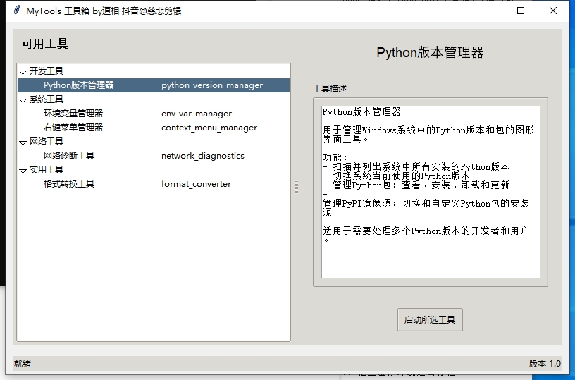
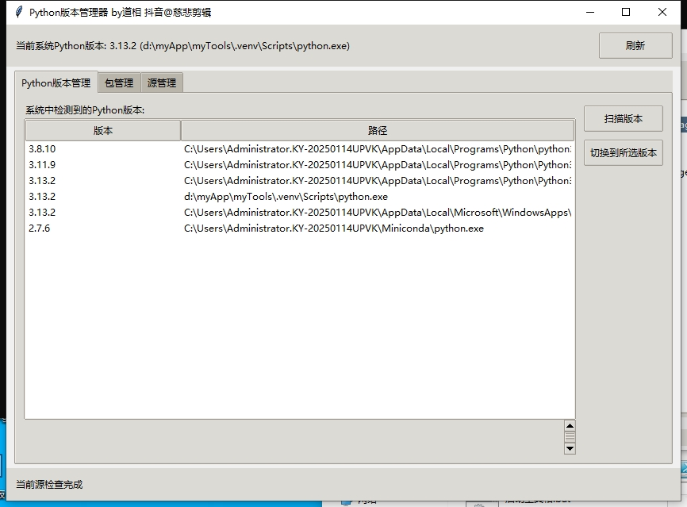
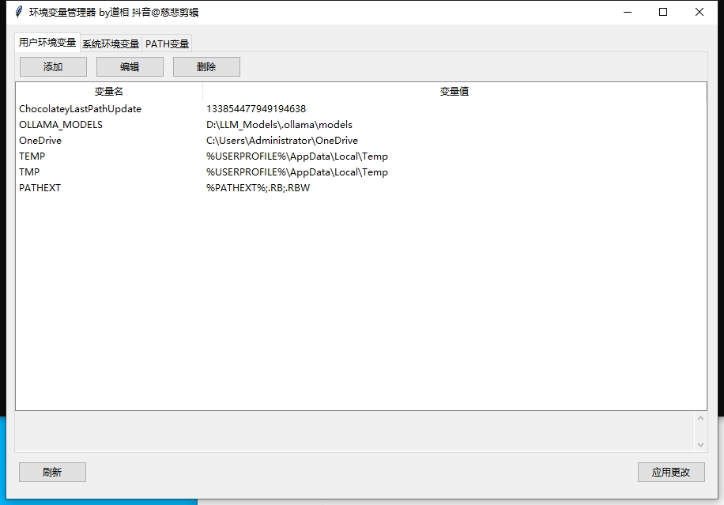
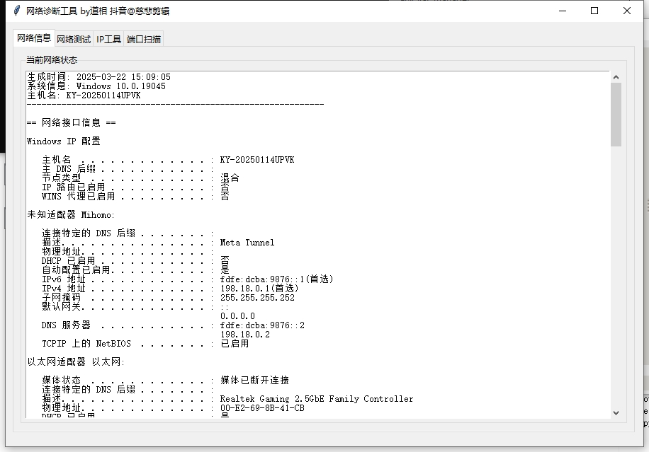

# MyTools 工具箱

**作者**：道相 
**抖音**@慈悲剪辑（技术问题点关注留言）

这是一个集成了多种实用工具的GUI应用程序，开箱即用！帮助用户提高工作效率，你也可以以脚本的形式方便地将工具集成到这个开源工具中，随时使用。远吗中尽量用中文添加详细注释，方便不懂英文的同胞们学习修改。



## 当前包含的工具

- **Python版本管理器**: 管理Windows系统中的Python版本和包的图形界面工具，可以扫描系统中安装的Python版本、切换默认版本、管理包和PyPI镜像源。包管理提供了包功能的翻译，对不懂英文的同胞十分友好！



- **环境变量管理器**: 查看和管理Windows系统环境变量的图形界面工具，可以编辑用户和系统环境变量、管理PATH变量路径，并实时应用更改。



- **网络诊断工具**: 用于网络测试、IP查询、端口扫描和网络状态分析的图形界面工具，可以查看系统网络配置、执行网络测试、进行IP地址查询和端口扫描。



- **右键菜单管理器**: 用于查看、添加、修改和删除Windows右键菜单项的工具，可以管理文件、目录和桌面右键菜单，轻松自定义Windows上下文菜单。

- **格式转换工具**: 多功能文件格式转换工具，支持视频、音频、图片等多种格式的相互转换，包括MP4转GIF、音频格式转换和图片格式转换等功能。

## 系统要求

- Windows操作系统
- Python 3.6或更高版本
- tkinter (Python标准库自带)

## 安装和运行

### 方法1：直接运行（推荐）

1. 克隆或下载此仓库
2. 双击`启动工具箱.bat`文件运行
   - 此脚本会自动创建虚拟环境并安装所需依赖
   - 首次运行可能需要几分钟时间来设置环境

如果需要管理员权限（例如使用环境变量管理器时），请使用`管理员启动.bat`。

### 方法2：使用PowerShell

双击`启动工具箱.ps1`文件，或在PowerShell中运行：
```powershell
.\启动工具箱.ps1
```
此脚本同样会自动设置虚拟环境和安装依赖。

### 方法3：手动设置虚拟环境

```bash
# 创建虚拟环境
python -m venv .venv

# 激活虚拟环境（Windows PowerShell）
.\.venv\Scripts\Activate.ps1
# 或激活虚拟环境（Windows cmd）
.\.venv\Scripts\activate.bat

# 安装依赖
pip install -r requirements.txt

# 运行工具箱
python mytools.py
```

## 目录结构

```
myTools/  # 根目录
├── mytools.py  # 工具箱主程序
├── 启动工具箱.bat  # 中文名称的启动脚本
├── 启动工具箱.ps1  # PowerShell启动脚本
├── 管理员启动.bat  # 管理员权限启动脚本
├── python_version_manager/  # Python版本管理器模块
│   ├── __init__.py
│   ├── main.py
│   ├── ui.py
│   └── utils.py
├── env_var_manager/  # 环境变量管理器模块
│   ├── __init__.py
│   ├── main.py
│   └── utils.py
├── network_diagnostics/  # 网络诊断工具模块
│   ├── __init__.py
│   ├── main.py
│   └── utils.py
├── context_menu_manager/  # 右键菜单管理器模块
│   ├── __init__.py
│   ├── main.py
│   └── utils.py
├── format_converter/  # 格式转换工具模块
│   ├── __init__.py
│   ├── main.py
│   └── utils.py
├── network_diagnostics_tool.py  # 网络诊断工具入口
├── context_menu_tool.py  # 右键菜单管理器入口
├── image/  # 工具截图目录
├── .venv/  # 虚拟环境(自动创建)
└── requirements.txt  # 依赖包列表
```

## 如何添加新工具

如果您想为工具箱添加新的工具，请按照以下步骤操作：

1. 在根目录下创建新的工具模块目录，例如`new_tool/`
2. 在新工具目录中创建必要的Python文件
3. 在`mytools.py`的`add_tools_to_list`方法中添加新工具的条目
4. 在`descriptions`字典中添加新工具的描述
5. 在`launch_selected_tool`方法中添加启动新工具的代码

## 常见问题

### 工具箱无法启动

- 确保已安装Python并添加到系统PATH
- 检查是否安装了tkinter库
- 尝试使用管理员权限运行启动脚本

### 无法启动特定工具

- 检查工具所需的依赖包是否已安装
- 查看控制台输出的错误信息
- 确保工具的路径正确

## 贡献

欢迎贡献代码、报告问题或提出改进建议。请通过GitHub Issues或Pull Requests参与项目开发。

## 许可

本项目使用MIT许可证。详见LICENSE文件。 